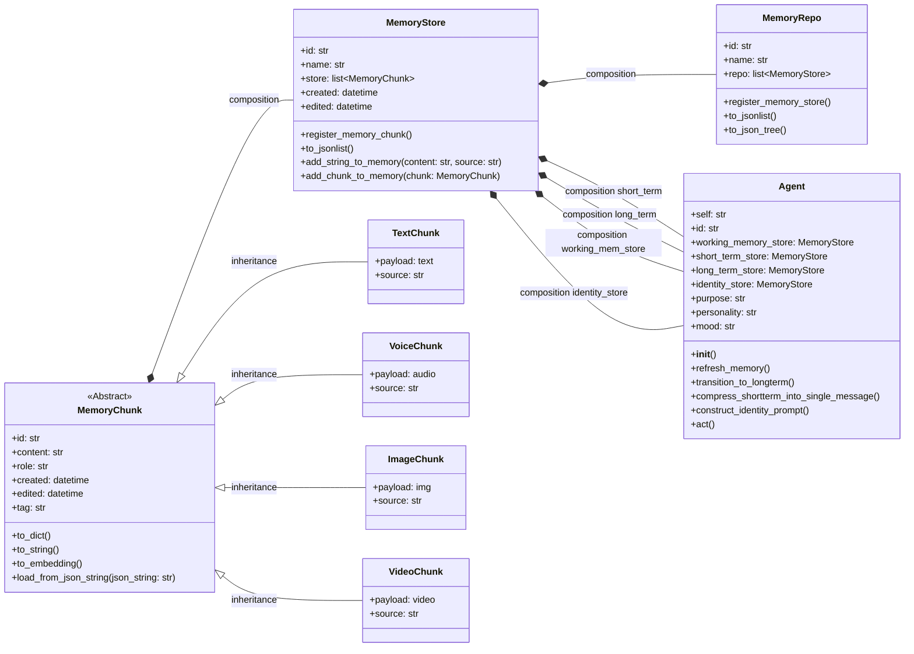

```mermaid

classDiagram
direction RL

    class Agent {
        +self: str
        +id: str
        +working_memory_store: MemoryStore 
        +short_term_store: MemoryStore
        +long_term_store: MemoryStore
        %% this will help composing the system message purpose, mood etc
        +identity_store: MemoryStore
        +purpose: str
        +personality: str
        +mood: str
        +__init__()
        +refresh_memory()
        +transition_to_longterm()
        +compress_shortterm_into_single_message()
        +construct_identity_prompt()
        +act()
    }

    class MemoryChunk {
        <<Abstract>>
        +id: str
        +content: str
        +role: str
        +created: datetime
        +edited: datetime
        +tag: str
        %% +embedding: list~int~
        +to_dict()
        +to_string()
        +to_embedding()
        +load_from_json_string(json_string: str)


    }

    class MemoryStore {
        +id: str
        +name: str
        %% can also be a queue
        +store: list~MemoryChunk~
        +created: datetime
        +edited: datetime
        +register_memory_chunk()
        +to_jsonlist()
        +add_string_to_memory(content: str, source: str)
        +add_chunk_to_memory(chunk: MemoryChunk)

    }

    class MemoryRepo {
        +id: str
        +name: str
        +repo: list~MemoryStore~
        +register_memory_store()
        +to_jsonlist()
        +to_json_tree()
    }

    class TextChunk {
        +payload: text
        +source: str
    }

    class ImageChunk {
        +payload: img
        +source: str
    }

    class VideoChunk {
        +payload: video
        +source: str
    }

    class VoiceChunk {
        +payload: audio
        +source: str
    }


    MemoryStore --* MemoryChunk : composition
    MemoryRepo --* MemoryStore : composition
    TextChunk --|> MemoryChunk : inheritance
    VoiceChunk --|> MemoryChunk : inheritance
    ImageChunk --|> MemoryChunk : inheritance
    VideoChunk --|> MemoryChunk : inheritance
    Agent --* MemoryStore : composition short_term
    Agent --* MemoryStore : composition long_term
    Agent --* MemoryStore : composition working_mem_store
    Agent --* MemoryStore : composition identity_store

```

