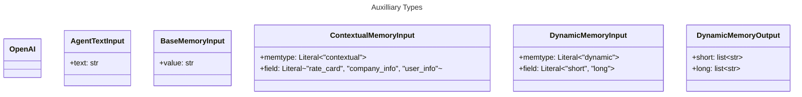

```mermaid
---
title: Auxilliary Types
---

classDiagram
direction L
 class OpenAI {
    }

    class AgentTextInput {
        +text: str
    }

    class BaseMemoryInput {
        +value: str
    }

    class ContextualMemoryInput {
        +memtype: Literal~"contextual"~
        +field: Literal~"rate_card", "company_info", "user_info"~
    }

    class DynamicMemoryInput {
        +memtype: Literal~"dynamic"~
        +field: Literal~"short", "long"~
    }

    class DynamicMemoryOutput {
        +short: list~str~
        +long: list~str~
    }


```