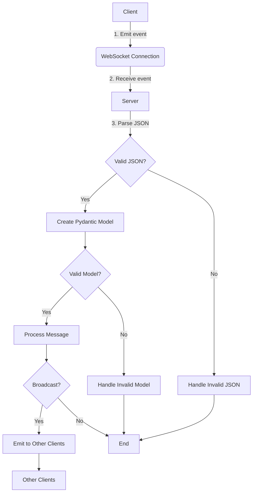

# How socket communication between client and server would work

```python

class GenericSocketMessage(BaseModel):
    _type: "TimelineEvent"
    payload: Payload

class Payload:
    timeline: str "god_timeline"
    action: Action


```


