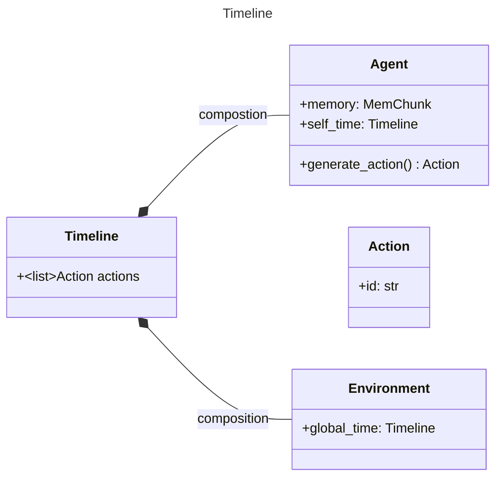
```mermaid
---
title: Timeline
---

classDiagram
    direction RL
    class Timeline {
        +~list~Action actions 
    }
    
    class Agent {
        +memory: MemChunk
        +self_time: Timeline
        +generate_action() Action
    }

    class Action {
        +id: str
    }

    class Environment {
        +global_time: Timeline
    }

    
    Agent --* Timeline : compostion
    Environment --* Timeline: composition
```

YOu have a global timeline
the global timeline is a series of Events / Actions 
All the agents participating in that timeline get to see the events / actions 
Each agent has a private timeline - this is like their internal mindscape (the internal timeline where you do your thinking and decisioning in)
The private timeline is the global timline plus your private one which is forward looking and where you take the time to think before acting 
An agent takes an action, this leads to the creation of an Event 
The agent may take some steps on their internal timeline to arrive at the final action
The final action is what gets committed onto the timeline 
Inner steps an agent can take include creating a feedback loop / emotion / reward and using that to critique their own actions. 
Inner steps, is mental processes, that the brain forms to guide their final action
An example is an interviewer getting constant feedback from a rater and incorporating that feedback into the next generation
An action is a collapse function, which is a perturbation in one or more of the fields
A timeline consists of fields, there is a text field (or a symbolic field), then there is audio, video and image 
An action is a submission on one of those fields
An action creates an event - an event is a time-indexed object that has the submission onto the fields 
Every event necessarily will submit all field values, but null values are allowed which persist the prev value 


There needs to be a layer that translates an action to an event. Are they equivalent? 
An event is a something that happens that you have not caused, an other's action if you may 
An action is something you cause, it is the event you created 
So when an action meets the timeline it becomes an event, the submission process is the god function taking the event and registering it onto the timeline 

What benefits will decoupling events and actions give me, and what would a god function do more than simply acting as a passing layer
Because if there is no difference, and they are just same data structure with different names then it would make sense to coalesce them

Can a timeline have multiple timeline channels, what does multiplayer look like in your architecture of time?

What does an individual look like?

Is each thing that people conventionally call an agent just an inner step or a habit former? 
An inner step is a series of mental actions taken to arrive at a decision 
A mental action could be
- summarize this section 
- create a rater for my actions 

a mental process has a purpose / a goal, an approach, a mental state,

habit former can be a good name for the inner steps also 


### Current synthesis  
There are two agents at play, an interviewer agent and a candidate agent.
An agent can be human backed, so the candidate agent can either be a human or an ai backed one. 
The interviewer agent has a mental process attached to their actions that guides their actions. 
The interview is the global time thread. 
On this time thread an agent submits actions. 
Actions and events are the yin and yang, one is what you generate and one is how the world reacts to it.
An action is just a perturbation on the field you desire to perturb. 
The event is a collection of all the current field values - text, image, audio, etc. 
Thus there does need to be a god function, that takes an action and adds it onto the timestream.
Let's call the global timeline timestream, i think its a much better name for the class. 


Above is a collection of thoughts on a schema design for a project i am working on. It is to build agents in as close to physics sense as possible. Hence I have used so many words like timeline, event. 

When considering those parts take on these role:
- you are a genius at schema design and can balance scaleability and speed, knowing which are good tradeoffs to make earlier on that are reversible down the line. You are confident in your abilities to make the right tradeoffs and be measured on which ones you commit to. 
- You are also deeply romantic about physics and biology. You are deeply self taught and have a polymath understanding of those subjects in addition to philosophy, mathematics and are able to think at a level 6 on the Bloom's scale. 
 
Purpose:
You are now helping me build a schema design that we will iterate on. You will generate the schema in mermaid syntax in a code block. 


Taking all the above context into account and the roles mentioned above, here is a schema design to get started on and some key points for you to think through 


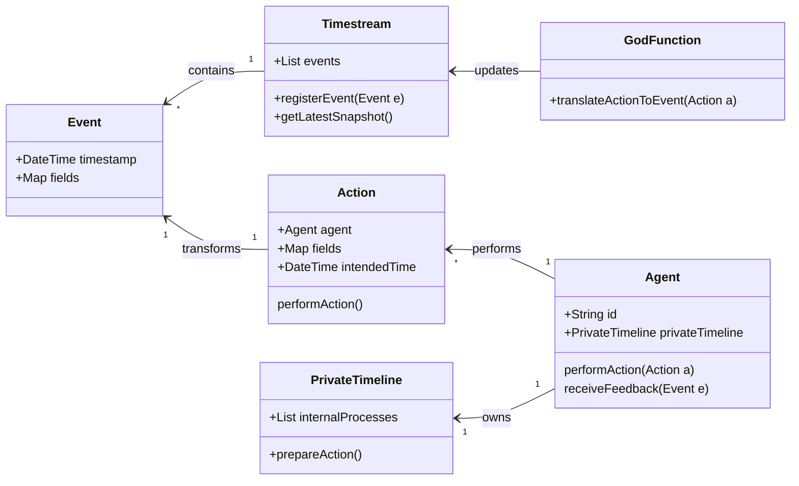
```mermaid
classDiagram
direction RL
    class Timestream {
        +List events
        +registerEvent(Event e)
        +getLatestSnapshot()
    }

    class Event {
        +DateTime timestamp
        +Map fields
    }

    class Action {
        +Agent agent
        +Map fields
        +DateTime intendedTime
        performAction()
    }

    class Agent {
        +String id
        +PrivateTimeline privateTimeline
        performAction(Action a)
        receiveFeedback(Event e)
    }

    class PrivateTimeline {
        +List internalProcesses
        +prepareAction()
    }

    class GodFunction {
        +translateActionToEvent(Action a)
    }

    Timestream "1" --> "*" Event : contains
    Agent "1" --> "1" PrivateTimeline : owns
    Agent "1" --> "*" Action : performs
    GodFunction --> Timestream : updates
    Action "1" --> "1" Event : transforms
```

Modify the above diagrams flow a bit. It shows both agents getting started without stimulation. An agent starts off the Mimestream by adding an event to which the other agent reacts to 

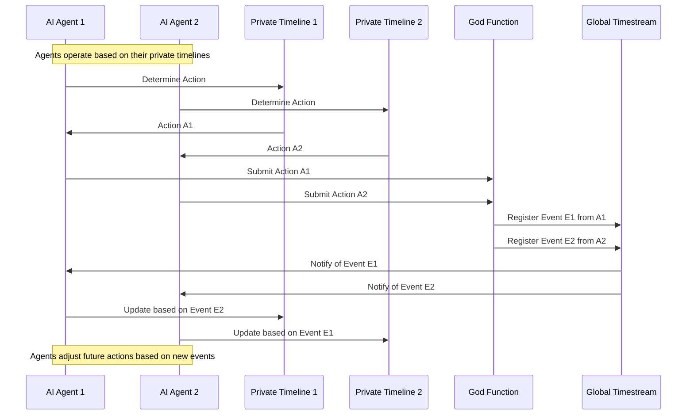
```mermaid
sequenceDiagram
    participant AI_Agent1 as AI Agent 1
    participant AI_Agent2 as AI Agent 2
    participant PrivateTimeline1 as Private Timeline 1
    participant PrivateTimeline2 as Private Timeline 2
    participant GodFunction as God Function
    participant Timestream as Global Timestream

    Note over AI_Agent1, AI_Agent2: Agents operate based on their private timelines
    AI_Agent1->>PrivateTimeline1: Determine Action
    AI_Agent2->>PrivateTimeline2: Determine Action

    PrivateTimeline1->>AI_Agent1: Action A1
    PrivateTimeline2->>AI_Agent2: Action A2

    AI_Agent1->>GodFunction: Submit Action A1
    AI_Agent2->>GodFunction: Submit Action A2

    GodFunction->>Timestream: Register Event E1 from A1
    GodFunction->>Timestream: Register Event E2 from A2

    Timestream->>AI_Agent1: Notify of Event E1
    Timestream->>AI_Agent2: Notify of Event E2

    AI_Agent1->>PrivateTimeline1: Update based on Event E2
    AI_Agent2->>PrivateTimeline2: Update based on Event E1

    Note over AI_Agent1, AI_Agent2: Agents adjust future actions based on new events

```
Modify the above diagrams flow a bit. It shows both agents getting started without stimulation. An agent starts off the Mimestream by adding an event to which the other agent reacts to 

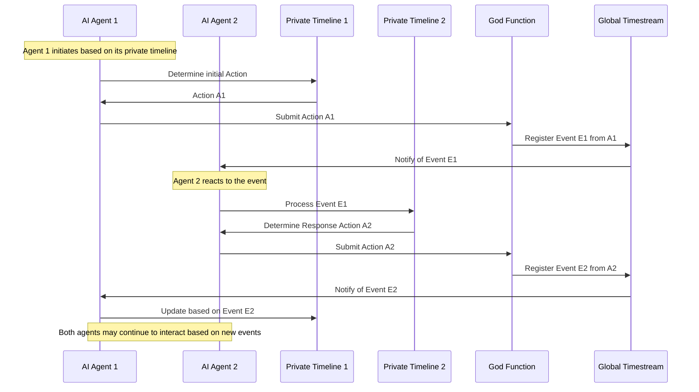
```mermaid
sequenceDiagram
    participant AI_Agent1 as AI Agent 1
    participant AI_Agent2 as AI Agent 2
    participant PrivateTimeline1 as Private Timeline 1
    participant PrivateTimeline2 as Private Timeline 2
    participant GodFunction as God Function
    participant Timestream as Global Timestream

    Note over AI_Agent1: Agent 1 initiates based on its private timeline
    AI_Agent1->>PrivateTimeline1: Determine initial Action
    PrivateTimeline1->>AI_Agent1: Action A1

    AI_Agent1->>GodFunction: Submit Action A1
    GodFunction->>Timestream: Register Event E1 from A1
    Timestream->>AI_Agent2: Notify of Event E1

    Note over AI_Agent2: Agent 2 reacts to the event
    AI_Agent2->>PrivateTimeline2: Process Event E1
    PrivateTimeline2->>AI_Agent2: Determine Response Action A2

    AI_Agent2->>GodFunction: Submit Action A2
    GodFunction->>Timestream: Register Event E2 from A2

    Timestream->>AI_Agent1: Notify of Event E2
    AI_Agent1->>PrivateTimeline1: Update based on Event E2

    Note over AI_Agent1, AI_Agent2: Both agents may continue to interact based on new events

```

Modify this to help better visualize. Keep the Global timestream in the center and the two agents on either side. It's pretty much the same but helps visualize better. 

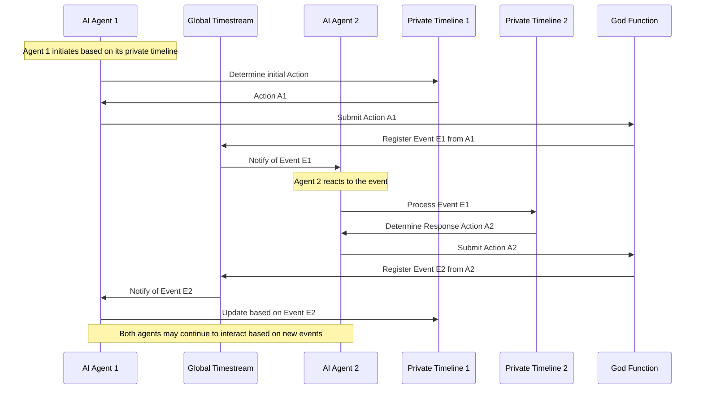
```mermaid

sequenceDiagram
    participant AI_Agent1 as AI Agent 1
    participant Timestream as Global Timestream
    participant AI_Agent2 as AI Agent 2
    participant PrivateTimeline1 as Private Timeline 1
    participant PrivateTimeline2 as Private Timeline 2
    participant GodFunction as God Function

    Note over AI_Agent1: Agent 1 initiates based on its private timeline
    AI_Agent1->>PrivateTimeline1: Determine initial Action
    PrivateTimeline1->>AI_Agent1: Action A1

    AI_Agent1->>GodFunction: Submit Action A1
    GodFunction->>Timestream: Register Event E1 from A1
    Timestream->>AI_Agent2: Notify of Event E1

    Note over AI_Agent2: Agent 2 reacts to the event
    AI_Agent2->>PrivateTimeline2: Process Event E1
    PrivateTimeline2->>AI_Agent2: Determine Response Action A2

    AI_Agent2->>GodFunction: Submit Action A2
    GodFunction->>Timestream: Register Event E2 from A2

    Timestream->>AI_Agent1: Notify of Event E2
    AI_Agent1->>PrivateTimeline1: Update based on Event E2

    Note over AI_Agent1, AI_Agent2: Both agents may continue to interact based on new events
```


The classes filled out with functions

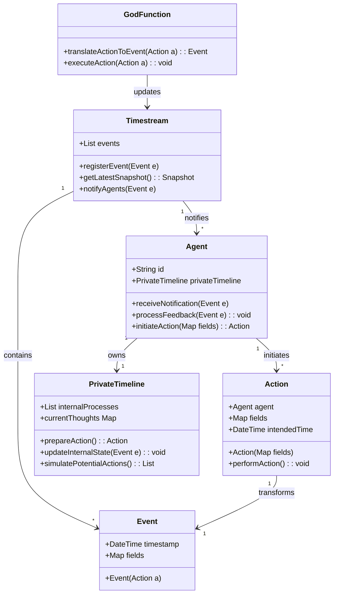
```mermaid

classDiagram
    class Timestream {
        +List events
        +registerEvent(Event e)
        +getLatestSnapshot() : Snapshot
        +notifyAgents(Event e)
    }

    class Event {
        +DateTime timestamp
        +Map fields
        +Event(Action a)
    }

    class Action {
        +Agent agent
        +Map fields
        +DateTime intendedTime
        +Action(Map fields)
        +performAction() : void
    }

    class Agent {
        +String id
        +PrivateTimeline privateTimeline
        +receiveNotification(Event e)
        +processFeedback(Event e) : void
        +initiateAction(Map fields) : Action
    }

    class PrivateTimeline {
        +List internalProcesses
        +currentThoughts Map
        +prepareAction() : Action
        +updateInternalState(Event e) : void
        +simulatePotentialActions() : List
    }

    class GodFunction {
        +translateActionToEvent(Action a) : Event
        +executeAction(Action a) : void
    }

    Timestream "1" --> "*" Event : contains
    Agent "1" --> "1" PrivateTimeline : owns
    Agent "1" --> "*" Action : initiates
    GodFunction --> Timestream : updates
    Action "1" --> "1" Event : transforms
    Timestream "1" --> "*" Agent : notifies
```


Attributes filled out

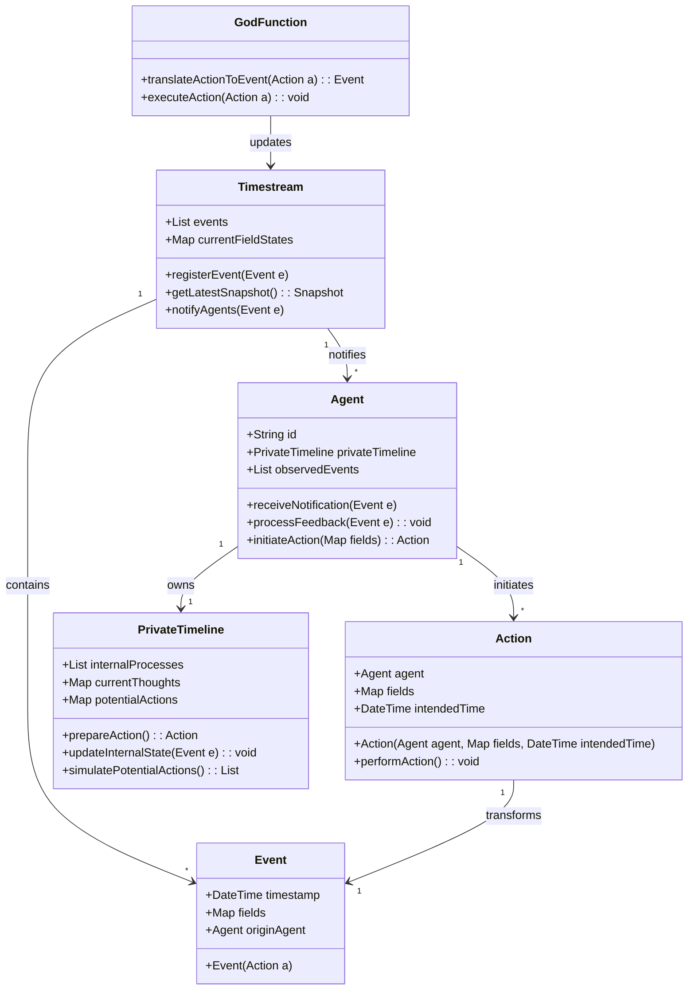
```mermaid

classDiagram
    class Timestream {
        +List events
        +Map currentFieldStates
        +registerEvent(Event e)
        +getLatestSnapshot() : Snapshot
        +notifyAgents(Event e)
    }

    class Event {
        +DateTime timestamp
        +Map fields
        +Agent originAgent
        +Event(Action a)
    }

    class Action {
        +Agent agent
        +Map fields
        +DateTime intendedTime
        +Action(Agent agent, Map fields, DateTime intendedTime)
        +performAction() : void
    }

    class Agent {
        +String id
        +PrivateTimeline privateTimeline
        +List observedEvents
        +receiveNotification(Event e)
        +processFeedback(Event e) : void
        +initiateAction(Map fields) : Action
    }

    class PrivateTimeline {
        +List internalProcesses
        +Map currentThoughts
        +Map potentialActions
        +prepareAction() : Action
        +updateInternalState(Event e) : void
        +simulatePotentialActions() : List
    }

    class GodFunction {
        +translateActionToEvent(Action a) : Event
        +executeAction(Action a) : void
    }

    Timestream "1" --> "*" Event : contains
    Agent "1" --> "1" PrivateTimeline : owns
    Agent "1" --> "*" Action : initiates
    GodFunction --> Timestream : updates
    Action "1" --> "1" Event : transforms
    Timestream "1" --> "*" Agent : notifies
```

Integrate plans into the mix

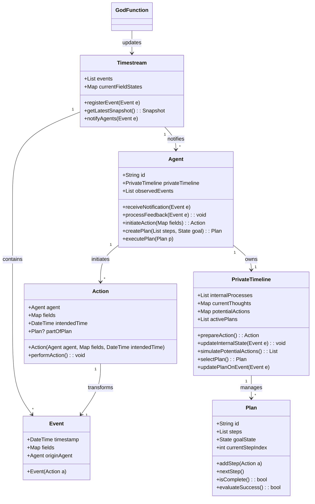
```mermaid

classDiagram
    class Timestream {
        +List events
        +Map currentFieldStates
        +registerEvent(Event e)
        +getLatestSnapshot() : Snapshot
        +notifyAgents(Event e)
    }

    class Event {
        +DateTime timestamp
        +Map fields
        +Agent originAgent
        +Event(Action a)
    }

    class Action {
        +Agent agent
        +Map fields
        +DateTime intendedTime
        +Plan? partOfPlan
        +Action(Agent agent, Map fields, DateTime intendedTime)
        +performAction() : void
    }

    class Agent {
        +String id
        +PrivateTimeline privateTimeline
        +List observedEvents
        +receiveNotification(Event e)
        +processFeedback(Event e) : void
        +initiateAction(Map fields) : Action
        +createPlan(List<Action> steps, State goal) : Plan
        +executePlan(Plan p)
    }

    class PrivateTimeline {
        +List internalProcesses
        +Map currentThoughts
        +Map potentialActions
        +List activePlans
        +prepareAction() : Action
        +updateInternalState(Event e) : void
        +simulatePotentialActions() : List
        +selectPlan() : Plan
        +updatePlanOnEvent(Event e)
    }

    class Plan {
        +String id
        +List steps
        +State goalState
        +int currentStepIndex
        +addStep(Action a)
        +nextStep()
        +isComplete() : bool
        +evaluateSuccess() : bool
    }

    Timestream "1" --> "*" Event : contains
    Agent "1" --> "1" PrivateTimeline : owns
    Agent "1" --> "*" Action : initiates
    GodFunction --> Timestream : updates
    Action "1" --> "1" Event : transforms
    Timestream "1" --> "*" Agent : notifies
    PrivateTimeline "1" --> "*" Plan : manages
```


Ok let's make this more efficient and elegant. We do not repeat ourselves. So the process that translates an action to an event is God on the global time stream, and for an agent it is the self. The self and god are analogous except for the domains they orchestrate. The self controls their inner landscape, thus their internal memories and private timeline, while only god has orchestration rights on the global time stream. Additionally both god and self have an internal processing queue, they are not simply a pass through validation function. Add that into the mix

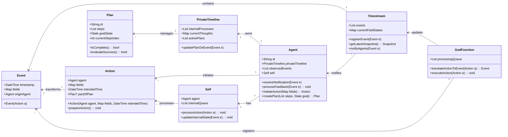
```mermaid

classDiagram
direction RL
    class Timestream {
        +List events
        +Map currentFieldStates
        +registerEvent(Event e)
        +getLatestSnapshot() : Snapshot
        +notifyAgents(Event e)
    }

    class Event {
        +DateTime timestamp
        +Map fields
        +Agent originAgent
        +Event(Action a)
    }

    class Action {
        +Agent agent
        +Map fields
        +DateTime intendedTime
        +Plan? partOfPlan
        +Action(Agent agent, Map fields, DateTime intendedTime)
        +prepareAction() : void
    }

    class Agent {
        +String id
        +PrivateTimeline privateTimeline
        +List observedEvents
        +Self self
        +receiveNotification(Event e)
        +processFeedback(Event e) : void
        +initiateAction(Map fields) : Action
        +createPlan(List<Action> steps, State goal) : Plan
    }

    class Self {
        +Agent agent
        +List internalQueue
        +processAction(Action a) : void
        +updateInternalState(Event e) : void
    }

    class PrivateTimeline {
        +List internalProcesses
        +Map currentThoughts
        +List activePlans
        +updatePlanOnEvent(Event e)
    }

    class GodFunction {
        +List processingQueue
        +translateActionToEvent(Action a) : Event
        +executeAction(Action a) : void
    }

    class Plan {
        +String id
        +List steps
        +State goalState
        +int currentStepIndex
        +isComplete() : bool
        +evaluateSuccess() : bool
    }

    Timestream "1" --> "*" Event : contains
    Agent "1" --> "1" PrivateTimeline : owns
    Agent "1" --> "*" Action : initiates
    Agent "1" --> "1" Self : has
    Self --> "*" Action : processes
    GodFunction --> Timestream : updates
    Action "1" --> "1" Event : transforms
    Timestream "1" --> "*" Agent : notifies
    PrivateTimeline "1" --> "*" Plan : manages
    GodFunction "1" --> "*" Event : registers
```


A society of agents?
where each agent can be a mental process?
Is there a difference between a mental process and an agent?

Okay, there is another layer of repeating ourselves that we are doing. I think mental processes and agents are similar concepts in that a thought is a society of agents interacting with each other. And like how Marvin Minsky put it in The Society of Mind, the agent is the main individual and the personification of a thought is a mental agent. So can you incorporate that into the architecture that we put together?


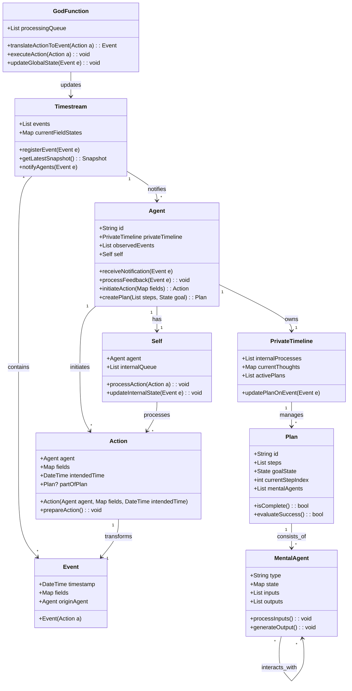
```mermaid

classDiagram
    class Timestream {
        +List events
        +Map currentFieldStates
        +registerEvent(Event e)
        +getLatestSnapshot() : Snapshot
        +notifyAgents(Event e)
    }

    class Event {
        +DateTime timestamp
        +Map fields
        +Agent originAgent
        +Event(Action a)
    }

    class Action {
        +Agent agent
        +Map fields
        +DateTime intendedTime
        +Plan? partOfPlan
        +Action(Agent agent, Map fields, DateTime intendedTime)
        +prepareAction() : void
    }

    class Agent {
        +String id
        +PrivateTimeline privateTimeline
        +List observedEvents
        +Self self
        +receiveNotification(Event e)
        +processFeedback(Event e) : void
        +initiateAction(Map fields) : Action
        +createPlan(List<Action> steps, State goal) : Plan
    }

    class MentalAgent {
        +String type
        +Map state
        +List inputs
        +List outputs
        +processInputs() : void
        +generateOutput() : void
    }

    class Self {
        +Agent agent
        +List internalQueue
        +processAction(Action a) : void
        +updateInternalState(Event e) : void
    }

    class PrivateTimeline {
        +List internalProcesses
        +Map currentThoughts
        +List activePlans
        +updatePlanOnEvent(Event e)
    }

    class Plan {
        +String id
        +List steps
        +State goalState
        +int currentStepIndex
        +List<MentalAgent> mentalAgents
        +isComplete() : bool
        +evaluateSuccess() : bool
    }

        class GodFunction {
        +List processingQueue
        +translateActionToEvent(Action a) : Event
        +executeAction(Action a) : void
        +updateGlobalState(Event e) : void
    }

    Timestream "1" --> "*" Event : contains
    Agent "1" --> "1" PrivateTimeline : owns
    Agent "1" --> "*" Action : initiates
    Agent "1" --> "1" Self : has
    Self --> "*" Action : processes
    GodFunction --> Timestream : updates
    Action "1" --> "1" Event : transforms
    Timestream "1" --> "*" Agent : notifies
    PrivateTimeline "1" --> "*" Plan : manages
    Plan "1" --> "*" MentalAgent : consists_of
    MentalAgent "*" --> "*" MentalAgent : interacts_with
```

Arent mental agents the same as an agent? Combine those two concepts and write out the detailed updated architecture

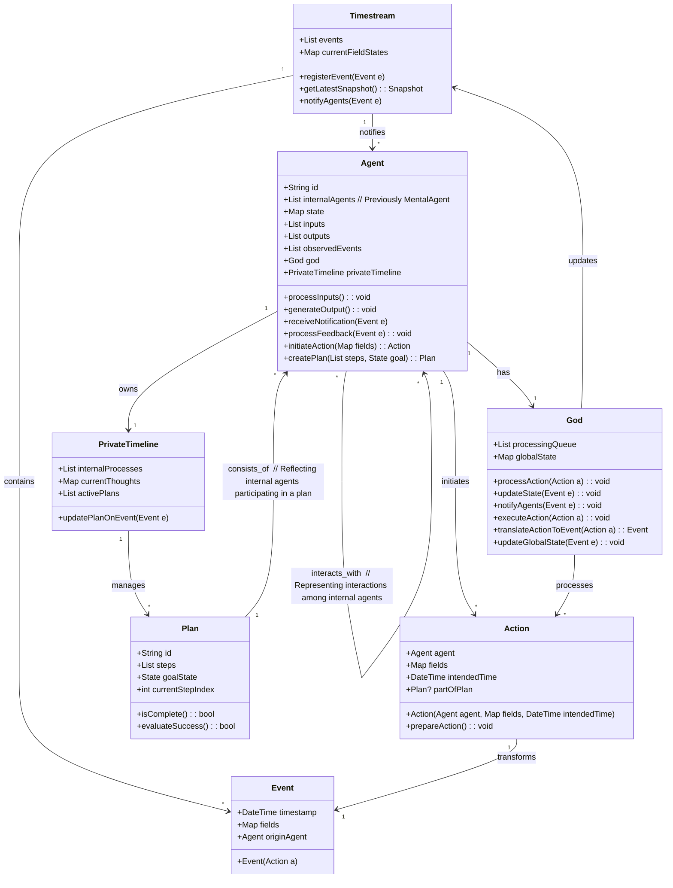
```mermaid
classDiagram
    class Timestream {
        +List events
        +Map currentFieldStates
        +registerEvent(Event e)
        +getLatestSnapshot() : Snapshot
        +notifyAgents(Event e)
    }

    class Event {
        +DateTime timestamp
        +Map fields
        +Agent originAgent
        +Event(Action a)
    }

    class Action {
        +Agent agent
        +Map fields
        +DateTime intendedTime
        +Plan? partOfPlan
        +Action(Agent agent, Map fields, DateTime intendedTime)
        +prepareAction() : void
    }

    class Agent {
        +String id
        +List<Agent> internalAgents  // Previously MentalAgent
        +Map state
        +List inputs
        +List outputs
        +List observedEvents
        +God god
        +PrivateTimeline privateTimeline
        +processInputs() : void
        +generateOutput() : void
        +receiveNotification(Event e)
        +processFeedback(Event e) : void
        +initiateAction(Map fields) : Action
        +createPlan(List<Action> steps, State goal) : Plan
    }

    class PrivateTimeline {
        +List internalProcesses
        +Map currentThoughts
        +List activePlans
        +updatePlanOnEvent(Event e)
    }

    class Plan {
        +String id
        +List steps
        +State goalState
        +int currentStepIndex
        +isComplete() : bool
        +evaluateSuccess() : bool
    }

    class God {
        +List processingQueue
        +Map globalState
        +processAction(Action a) : void
        +updateState(Event e) : void
        +notifyAgents(Event e) : void
        +executeAction(Action a) : void
        +translateActionToEvent(Action a) : Event
        +updateGlobalState(Event e) : void
    }

    Timestream "1" --> "*" Event : contains
    Agent "1" --> "1" PrivateTimeline : owns
    Agent "1" --> "*" Action : initiates
    Agent "1" --> "1" God : has
    God --> "*" Action : processes
    God --> Timestream : updates
    Action "1" --> "1" Event : transforms
    Timestream "1" --> "*" Agent : notifies
    PrivateTimeline "1" --> "*" Plan : manages
    Plan "1" --> "*" Agent : consists_of  // Reflecting internal agents participating in a plan
    Agent "*" --> "*" Agent : interacts_with  // Representing interactions among internal agents
```

Ok so we have a great starting point. Let's make things more specific. We are gonna update the UML code to do the following:
- You are variable names are generic, make them more specific and use the objects we have defined in the schema. Example, in `God` this `processingQueue` should be called `ActionQueue`
- You are using generic types such as `List` to represent a list of actions. Use the mermaid syntax to update the types. So here this `+List processingQueue` will update to `+~List~Action processingQueue`

Update the UML code to reflect this


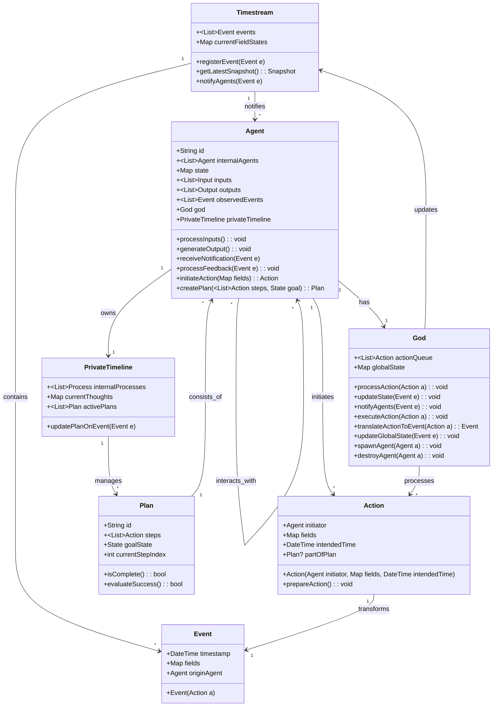
```mermaid
classDiagram
    class Timestream {
        +~List~Event events
        +Map currentFieldStates
        +registerEvent(Event e)
        +getLatestSnapshot() : Snapshot
        +notifyAgents(Event e)
    }

    class Event {
        +DateTime timestamp
        +Map fields
        +Agent originAgent
        +Event(Action a)
    }

    class Action {
        +Agent initiator
        +Map fields
        +DateTime intendedTime
        +Plan? partOfPlan
        +Action(Agent initiator, Map fields, DateTime intendedTime)
        +prepareAction() : void
    }

    class Agent {
        +String id
        +~List~Agent internalAgents
        +Map state
        +~List~Input inputs
        +~List~Output outputs
        +~List~Event observedEvents
        +God god
        +PrivateTimeline privateTimeline
        +processInputs() : void
        +generateOutput() : void
        +receiveNotification(Event e)
        +processFeedback(Event e) : void
        +initiateAction(Map fields) : Action
        +createPlan(~List~Action steps, State goal) : Plan
    }

    class PrivateTimeline {
        +~List~Process internalProcesses
        +Map currentThoughts
        +~List~Plan activePlans
        +updatePlanOnEvent(Event e)
    }

    class Plan {
        +String id
        +~List~Action steps
        +State goalState
        +int currentStepIndex
        +isComplete() : bool
        +evaluateSuccess() : bool
    }

    class God {
        +~List~Action actionQueue
        +Map globalState
        +processAction(Action a) : void
        +updateState(Event e) : void
        +notifyAgents(Event e) : void
        +executeAction(Action a) : void
        +translateActionToEvent(Action a) : Event
        +updateGlobalState(Event e) : void
        +spawnAgent(Agent a) : void
        +destroyAgent(Agent a) : void
    }

    Timestream "1" --> "*" Event : contains
    Agent "1" --> "1" PrivateTimeline : owns
    Agent "1" --> "*" Action : initiates
    Agent "1" --> "1" God : has
    God --> "*" Action : processes
    God --> Timestream : updates
    Action "1" --> "1" Event : transforms
    Timestream "1" --> "*" Agent : notifies
    PrivateTimeline "1" --> "*" Plan : manages
    Plan "1" --> "*" Agent : consists_of
    Agent "*" --> "*" Agent : interacts_with
```

Combine the private timeline and the timestream to be a single thing


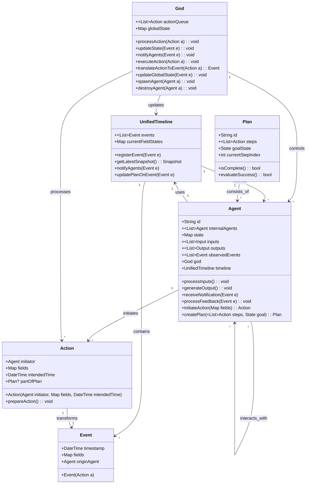
```mermaid

classDiagram
    class UnifiedTimeline {
        +~List~Event events
        +Map currentFieldStates
        +registerEvent(Event e)
        +getLatestSnapshot() : Snapshot
        +notifyAgents(Event e)
        +updatePlanOnEvent(Event e)
    }

    class Event {
        +DateTime timestamp
        +Map fields
        +Agent originAgent
        +Event(Action a)
    }

    class Action {
        +Agent initiator
        +Map fields
        +DateTime intendedTime
        +Plan? partOfPlan
        +Action(Agent initiator, Map fields, DateTime intendedTime)
        +prepareAction() : void
    }

    class Agent {
        +String id
        +~List~Agent internalAgents
        +Map state
        +~List~Input inputs
        +~List~Output outputs
        +~List~Event observedEvents
        +God god
        +UnifiedTimeline timeline
        +processInputs() : void
        +generateOutput() : void
        +receiveNotification(Event e)
        +processFeedback(Event e) : void
        +initiateAction(Map fields) : Action
        +createPlan(~List~Action steps, State goal) : Plan
    }

    class Plan {
        +String id
        +~List~Action steps
        +State goalState
        +int currentStepIndex
        +isComplete() : bool
        +evaluateSuccess() : bool
    }

    class God {
        +~List~Action actionQueue
        +Map globalState
        +processAction(Action a) : void
        +updateState(Event e) : void
        +notifyAgents(Event e) : void
        +executeAction(Action a) : void
        +translateActionToEvent(Action a) : Event
        +updateGlobalState(Event e) : void
        +spawnAgent(Agent a) : void
        +destroyAgent(Agent a) : void
    }

    God "1" --> "*" Agent : controls
    Agent "1" --> "1" UnifiedTimeline : uses
    UnifiedTimeline "1" --> "*" Event : contains
    Agent "1" --> "*" Action : initiates
    God --> "*" Action : processes
    God --> UnifiedTimeline : updates
    Action "1" --> "1" Event : transforms
    UnifiedTimeline "1" --> "*" Agent : notifies
    Plan "1" --> "*" Agent : consists_of
    Agent "*" --> "*" Agent : interacts_with
```

Think through:

Implementation plan:
- Agent emits actions
- Actions register directly on timeline as actions
- Actions convert to Events (introduce God)

Consolidation events and actions

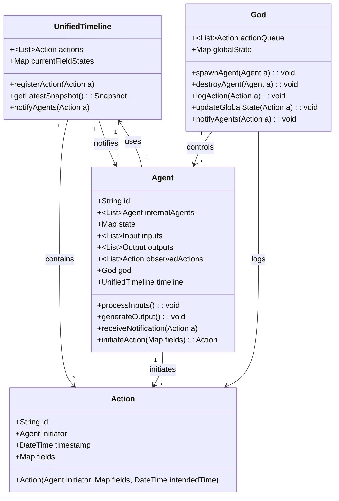
```mermaid
classDiagram
    class UnifiedTimeline {
        +~List~Action actions
        +Map currentFieldStates
        +registerAction(Action a)
        +getLatestSnapshot() : Snapshot
        +notifyAgents(Action a)
    }

    class Action {
        +String id
        +Agent initiator
        +DateTime timestamp
        +Map fields
        +Action(Agent initiator, Map fields, DateTime intendedTime)
    }

    class Agent {
        +String id
        +~List~Agent internalAgents
        +Map state
        +~List~Input inputs
        +~List~Output outputs
        +~List~Action observedActions
        +God god
        +UnifiedTimeline timeline
        +processInputs() : void
        +generateOutput() : void
        +receiveNotification(Action a)
        +initiateAction(Map fields) : Action
    }

    class God {
        +~List~Action actionQueue
        +Map globalState
        +spawnAgent(Agent a) : void
        +destroyAgent(Agent a) : void
        +logAction(Action a) : void
        +updateGlobalState(Action a) : void
        +notifyAgents(Action a) : void
    }

    God "1" --> "*" Agent : controls
    Agent "1" --> "1" UnifiedTimeline : uses
    UnifiedTimeline "1" --> "*" Action : contains
    Agent "1" --> "*" Action : initiates
    God --> "*" Action : logs
    UnifiedTimeline "1" --> "*" Agent : notifies
```


Actual that I am building

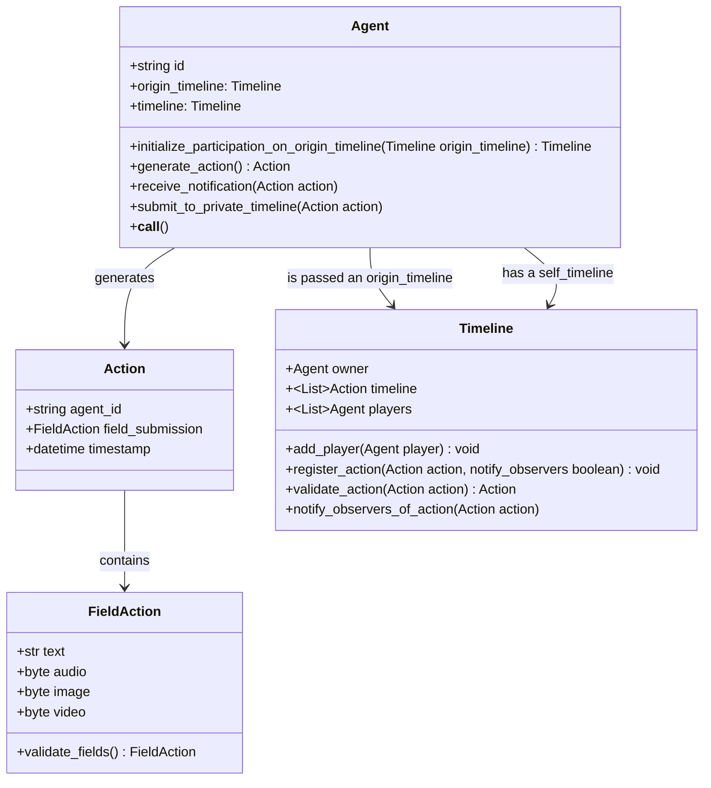
```mermaid

classDiagram
    class Agent {
        +string id
        +origin_timeline: Timeline
        +timeline: Timeline
        +initialize_participation_on_origin_timeline(Timeline origin_timeline) Timeline
        +generate_action() Action
        +receive_notification(Action action)
        +submit_to_private_timeline(Action action)
        +__call__()
    }

    class Action {
    +string agent_id
    +FieldAction field_submission
    +datetime timestamp
    }

    class FieldAction {
    +str text
    +byte audio
    +byte image
    +byte video
    +validate_fields() FieldAction
    }

    class Timeline {
    +Agent owner
    +~List~Action timeline
    +~List~Agent players
    +add_player(Agent player) void
    +register_action(Action action, notify_observers boolean) void
    +validate_action(Action action) Action
    +notify_observers_of_action(Action action)
    }

Agent --> Timeline : is passed an origin_timeline
Agent --> Timeline : has a self_timeline
Agent --> Action : generates
Action --> FieldAction : contains

```

PLan:
- When an action has been registered on the timeline, a notification is sent to the observing agent that there is an update to the timeline, do a fetch. 
- In the fetch function, the assistant, if it is llm powered, will reflect the messages so that the `human` becomes `assistant` and vice versa. 
- The timeline acts as the shared memory
- so there needs to be a reverse mechanism to convert the events to messages. But in my current architecture this is fine because I combined events and messages to be messaged, so the timleine is a collection of messages. This makes it easier to utilize as memory and load into a request object to send the AI. 

So when a notification is received from the timeline. 
- the agent pulls the updated timeline reflecting it if necessary. 
- loads this up as a response and sends it to the llm to get a response. 
- then repeat. 

The breakout condition 
- God keeps a track of message queue and if it exceeds a constraint length then it exits. 
- Ok you can do this by checking with god if it is ok to proceed as soon as the update notification of the timeline comes in 

Pseudo code:
```python
def reflect() -> None:
    "takes the time
    ...

def pull_origin_timeline():
    ...

def receive_notification():
    ...

def generate_response():
    ...

def send_update_notification_to_the_timeline():
    "the timeline will take care of updating the receiving agents"
    ...

def get_permission_from_god():
    "check if any breakout conditin is reached."
    ...

```


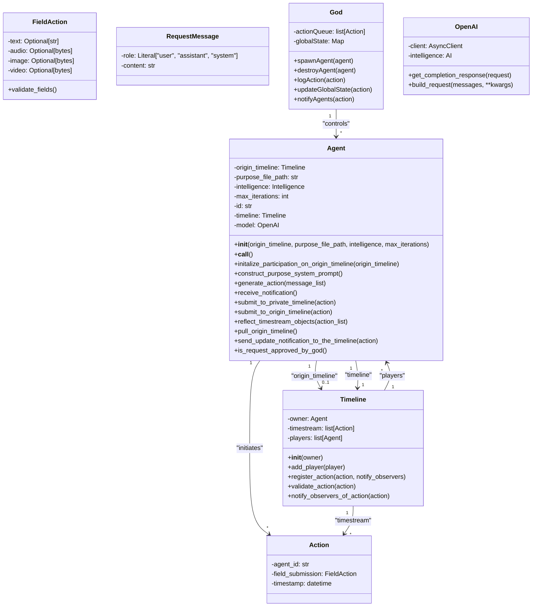
```mermaid
classDiagram

class Agent {
    -origin_timeline: Timeline
    -purpose_file_path: str
    -intelligence: Intelligence
    -max_iterations: int
    -id: str
    -timeline: Timeline
    -model: OpenAI
    +__init__(origin_timeline, purpose_file_path, intelligence, max_iterations)
    +__call__()
    +initalize_participation_on_origin_timeline(origin_timeline)
    +construct_purpose_system_prompt()
    +generate_action(message_list)
    +receive_notification()
    +submit_to_private_timeline(action)
    +submit_to_origin_timeline(action)
    +reflect_timestream_objects(action_list)
    +pull_origin_timeline()
    +send_update_notification_to_the_timeline(action)
    +is_request_approved_by_god()
}

class FieldAction {
    -text: Optional[str]
    -audio: Optional[bytes]
    -image: Optional[bytes]
    -video: Optional[bytes]
    +validate_fields()
}

class Action {
    -agent_id: str
    -field_submission: FieldAction
    -timestamp: datetime
}

class RequestMessage {
    -role: Literal["user", "assistant", "system"]
    -content: str
}

class Timeline {
    -owner: Agent
    -timestream: list[Action]
    -players: list[Agent]
    +__init__(owner)
    +add_player(player)
    +register_action(action, notify_observers)
    +validate_action(action)
    +notify_observers_of_action(action)
}

class God {
    -actionQueue: list[Action]
    -globalState: Map
    +spawnAgent(agent)
    +destroyAgent(agent)
    +logAction(action)
    +updateGlobalState(action)
    +notifyAgents(action)
}

class OpenAI {
    -client: AsyncClient
    -intelligence: AI
    +get_completion_response(request)
    +build_request(messages, **kwargs)
}

Agent "1" --> "0..1" Timeline : "origin_timeline"
Agent "1" --> "1" Timeline : "timeline"
Agent "1" --> "*" Action : "initiates"
Timeline "1" --> "*" Agent : "players"
Timeline "1" --> "*" Action : "timestream"
God "1" --> "*" Agent : "controls"
```


UI 

Agent screen

- Purpose 
- Self generation --> interview details:
  - Interviewer details
    - What is the role
    - what is the company
    - what is the team 
    - Generated Question Bank 
    - Generated rubric 
  - Candidate details


Memory:
- ideal_state
- current_state_reflection (self_critique)
- environmental_reflection (env_critique)
- 